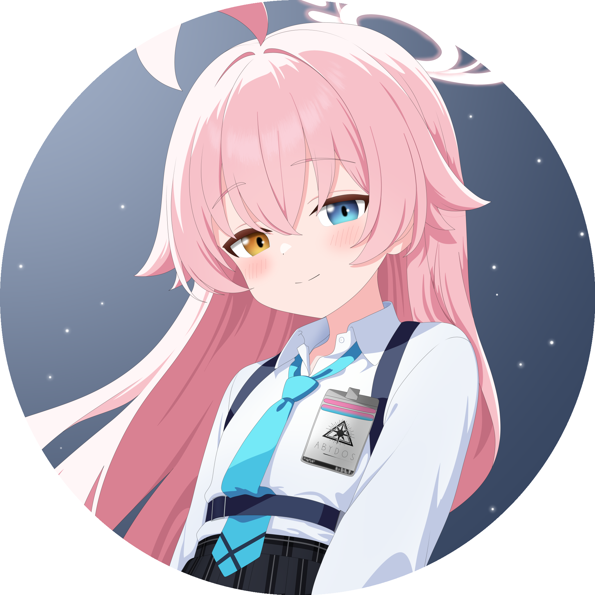

 <h1 style="color: #ff69b4;">Hi I'm ivy! 🌷 </h1>
 
And anyone visit this page, welcome to my github profile!

# 🌸 About Me 🌸

Hi there! I'm a **WhatsApp Bot Developer** who loves building **efficient**, **scalable**, and **fun** bots 🤖  
I focus on clean code, lightweight performance, and delivering the best chat experience possible.  
I believe automation should be both **smart** and **elegant** ✨  
I also enjoy building tiny side projects like **wrapping websites** into something more **useful** or **beautiful** 🌐🎀

---

- 🚀 **Frequently** working as a WhatsApp Bot Developer  
- 💻 Use **JavaScript** as my main language  
- 🌱 Love building **frontends** using **Vite.js** and **Vue.js**  
- 🎯 Focused on automation, **clean UI**, and **logic-driven** design  
- 🧪 Sometimes I explore experimental projects involving **AI** or **supernatural logic**

# 💻 My Stack

  
  
  
  
  

 

  

# 🛠️ Tools & Frameworks

  
  
  
  

# 📊 My GitHub Stats:

  
    
  
  
    
  

---

# 🏆 Achievements
- 🌟 Created and maintained **3+ open-source projects** in 2024.
- 🤖 Built multiple **WhatsApp bots** used by small communities.
- 💬 Active contributor in bot developer groups on Discord & GitHub.
- 📈 Achieved consistent contribution streaks & project growth.

  
  

# 🛠️ Current Projects
- 🛰️ Scaling lightweight **WhatsApp bots** with MongoDB & Baileys.
- 🎨 Experimenting with **Vite + Vue** for interactive dashboards.
- 🔧 Exploring automation tools to wrap websites into mobile-like interfaces.
- 🌸 [ShizukuBot](https://github.com/XNS-ivy/Shizuku-NeetChan) modular WhatsApp bot using Baileys.
- 📦 Public Repos: 0

### Extras 🌸

<table>
  <tr>
    <td width="130">
      
    </td>
    <td>
      

        <strong>Takanashi Hoshino</strong> is my favorite character on Blue Archive. She is cute, cheerful, but sometimes she gets too serious in some conditions.
      

    </td>
  </tr>
</table>
